```{r}
library(here)
library(tidyverse)
library(INLA)
library(hrbrthemes)
```

## Advanced Environmental Models

-   Distributed non-linear lag models

-   Spatially varying coefficients

-   Spatial DLNMs

## Distributed non-linear lag models

-   An exposure event is frequently associated with a risk lasting for a defined period in the future

-   The risk at a given time is assumed a result of protracted exposures experienced in the past

-   Examples include, drugs, carcinogens, etc.

Challenge: The risk should be modelled in terms of contributions depending on intensity and timing of the exposure events: bi-dimensional association (interaction).

## Example 1: Lung cancer and radon exposure

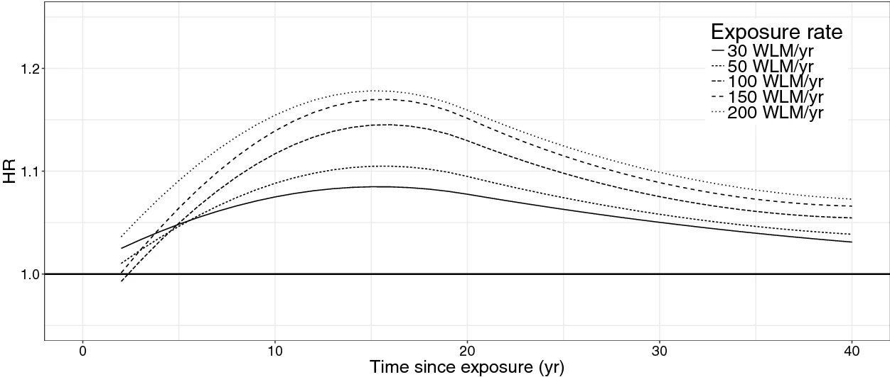

## Example 2: PM10 in Chicago

```{r}
#| echo: false
#| eval: true
#| warning: false
#| message: false

library(dlnm)
library(ggplot2)
library(dplyr)

k <- 1:16
res_store <- list()

for (i in 1:length(k)) {
  chicagoNMMAPS$pm10_laggeg <- lag(chicagoNMMAPS$pm10, n = k[i] - 1)

  mgcv::gam(
    death ~ s(temp) +
      s(time) + s(month) + dow + pm10_laggeg,
    data = chicagoNMMAPS, family = "poisson"
  ) -> tmp

  res_store[[i]] <- list(
    est = coef(tmp)["pm10_laggeg"],
    LL = coef(tmp)["pm10_laggeg"] - 1.96 * summary(tmp)$se["pm10_laggeg"],
    UL = coef(tmp)["pm10_laggeg"] + 1.96 * summary(tmp)$se["pm10_laggeg"]
  )
}


lapply(res_store, unlist) %>%
  do.call(rbind, .) %>%
  as_tibble() %>%
  mutate(
    type =
      factor(paste0("lag ", 0:15),
        levels = paste0("lag ", 0:15)
      )
  ) -> plotres

ggplot(data = plotres) +
  geom_point(aes(x = type, y = est.pm10_laggeg)) +
  # geom_line(aes(x=type, y=est.pm10_laggeg, group=1), linetype = "dashed") +
  geom_errorbar(aes(x = type, ymin = LL.pm10_laggeg,
                    ymax = UL.pm10_laggeg, width = 0.1)) +
  geom_hline(yintercept = 0, col = "red", linetype = "dotted") +
  theme_bw() +
  ylab("log risk PM10") +
  xlab("Lags") -> p1


ggplot(data = plotres) +
  geom_point(aes(x = type, y = est.pm10_laggeg)) +
  geom_line(aes(x = type, y = est.pm10_laggeg, group = 1)) +
  geom_ribbon(aes(x = type, ymin = LL.pm10_laggeg,
                  ymax = UL.pm10_laggeg, group = 1),
              fill = "blue", alpha = 0.2) +
  geom_hline(yintercept = 0, col = "red", linetype = "dotted") +
  theme_bw() +
  ylab("log risk PM10") +
  xlab("Lags") -> p2
```

```{r}
#| echo: false
#| eval: true
#| warning: false
#| message: false

chicagoNMMAPS %>% head()
```

## Example 2: PM10 in Chicago

What are the main assumptions here? (Spoiler: independence!!)

```{r}
#| echo: false
#| eval: true
#| fig-align: "center"
#| warning: false
#| message: false

library(patchwork)
(p1 + theme(text = element_text(size = 15))) /
  (p2 + theme(text = element_text(size = 15)))
```

## Distributed linear lag models

The unconstrained distributed lag model of order $q$ is:

$$Y_t = \beta_0 + \beta_{10}X_t + \beta_{11}X_{t-1} + \dots+ \beta_{1q}X_{t-q} + \epsilon_t$$

-   $\beta_{1\ell}$ is the effect at lag $\ell=0, 1, \dots q$ and $\epsilon_t$ an error term.

-   The overall impact for a unit change in $X$ is given by $\sum^q_{\ell=0}\beta_\ell$.

## Example 2: PM10 in Chicago

::: {style="font-size: 80%;"}
```{r}
#| echo: false
#| eval: true

chicagoNMMAPS$pm10_laggeg0 <- lag(chicagoNMMAPS$pm10, n = 0)
chicagoNMMAPS$pm10_laggeg1 <- lag(chicagoNMMAPS$pm10, n = 1)
chicagoNMMAPS$pm10_laggeg2 <- lag(chicagoNMMAPS$pm10, n = 2)
chicagoNMMAPS$pm10_laggeg3 <- lag(chicagoNMMAPS$pm10, n = 3)
chicagoNMMAPS$pm10_laggeg4 <- lag(chicagoNMMAPS$pm10, n = 4)

mgcv::gam(death ~ s(temp) +
  s(time) + s(month) + dow + pm10_laggeg0 + pm10_laggeg1 + pm10_laggeg2 +
  pm10_laggeg3 + pm10_laggeg4, data = chicagoNMMAPS, family = "poisson") -> mod_unc

cri <- 
  data.frame(
    pointest = summary(mod_unc)$p.coef, 
    LL = summary(mod_unc)$p.coef - 1.96*summary(mod_unc)$se[1:12],  
    UL = summary(mod_unc)$p.coef + 1.96*summary(mod_unc)$se[1:12])

cri <- cri %>% 
         filter(startsWith(rownames(cri), "pm10")) %>% 
         mutate(lag = 0:4, type = "joint")

rbind(
  plotres[1:5,] %>% 
  mutate(pointest = est.pm10_laggeg, 
         LL = LL.pm10_laggeg, 
         UL = UL.pm10_laggeg, 
         lag = 0:4, 
         type = "independent") %>% 
  select(pointest, LL, UL, lag, type), 
  cri
) %>% 
  ggplot() +
    geom_point(aes(x = lag, y = pointest, col = type),
               position = position_dodge(width = .5), size = 2) +
    geom_errorbar(aes(x = lag, ymin = LL,
                    ymax = UL,col = type), width = 0.1, lwd = 1,  
                  position = position_dodge(width = .5)) +
    geom_hline(yintercept = 0, col = "red", linetype = "dotted") +
    theme_bw() +
    ylab("log risk PM10") +
    xlab("Lags")

```
:::

::: {style="font-size: 80%;"}
## Considerations

-   Easy implementation when lags are few; overparametrized when we want to assess a lot of lags

-   Collinearity issues: The exposure is likely to be highly correlated with the values of the previous/after days. Weird behaviours in the point estimates (surprising protective effects), variance inflation.

Alternative: to impose some constraints!

-   A constant effect within lag intervals

-   Average of the exposures in the previous $L$ day

-   Describing the coefficients with a smooth curve using continuous functions such as splines, polynomials, and other basis functions.

The idea: $\beta_{\ell}$ can be modelled using a basis function.
:::

::: {style="font-size: 80%;"}
## Polynomial DLM

Let $\beta_\ell = \sum_j^p\tau_j\ell^j, \;\;\; \ell = 0, \dots, q$ , lets write it for 2 lags using a 3rd degree polynomial to see it explicitly:

\begin{align}Y_t &= \beta_0 + \beta_{10}X_t + \beta_{11}X_{t-1} + \beta_{12}X_{t-2} + \epsilon_t\\\beta_{10} &= \tau_0, \; \beta_{11} = \tau_0 + \tau_1 + \tau_2 + \tau_3, \; \beta_{12} = \tau_0 + \tau_1 2 + \tau_2 2^2 + \tau_3 2^3\end{align}

and we can modify as per first lecture to model more localized structures using: $\beta_\ell = \sum_j^p\tau_j\ell^j + \sum_k^K\nu_k(\ell-\kappa_k)^p_+$, thus:

\begin{align*}\beta_{10} &= \tau_0 + \nu_1(0-\kappa_1)^3_+ + \dots + \nu_K(0-\kappa_K)^3_+, \\\beta_{11} &= \tau_0 + \tau_1 + \tau_2 + \tau_3 + \nu_1(1-\kappa_1)^3_+ + \dots + \nu_K(1-\kappa_K)^3_+, \\\beta_{12} &= \tau_0 + \tau_1 2  + \tau_2 2^2 + \tau_3 2^3 + \nu_1(2-\kappa_1)^3_+ + \dots + \nu_K(2-\kappa_K)^3_+\end{align*}

and similarly we can penalize it can estimate *the penalised spline distributed lag estimate* of $\beta_{\ell}$
:::

## Polynomial DLM in R: Chicago

```{r}
#| echo: true
#| eval: true
cb1.pm <- crossbasis(chicagoNMMAPS$pm10,
  lag = 15, argvar = list(fun = "lin"),
  arglag = list(fun = "poly", degree = 4)
)
head(cb1.pm)
```

```{r}
#| echo: true
#| eval: true
cb1.pm[100:106,]
```

## Polynomial DLM in R: Chicago

```{r}
#| echo: false
#| eval: true
model_dlm <- mgcv::gam(death ~ s(temp) + s(time) + s(month) + dow + 
                         cb1.pm,
  family = poisson(), chicagoNMMAPS
)
```

```{r}
#| echo: true
#| eval: true
pred1.pm <- crosspred(cb1.pm, model_dlm, at = 0:20, bylag = 0.2)
plot(pred1.pm,
  ptype = "slices", var = 1, cumul = FALSE, ylab = "RR",
  main = "Association with a 1-unit increase in PM10"
)
```

What is the main assumption here? Can we relax it?

## Extension to distributed non-linear lag models

-   We know that temperature and mortality have a U-shape relationship

-   We know that high temperature has a lag effect on mortality

-   Can we define models to combine these two components?

The idea: to calculate this bi-dimensional relationship, we need a basis function that combines the basis function in the lag dimension and the basis function in the exposure dimension: **Cross-basis function**

## Linear-by-constant

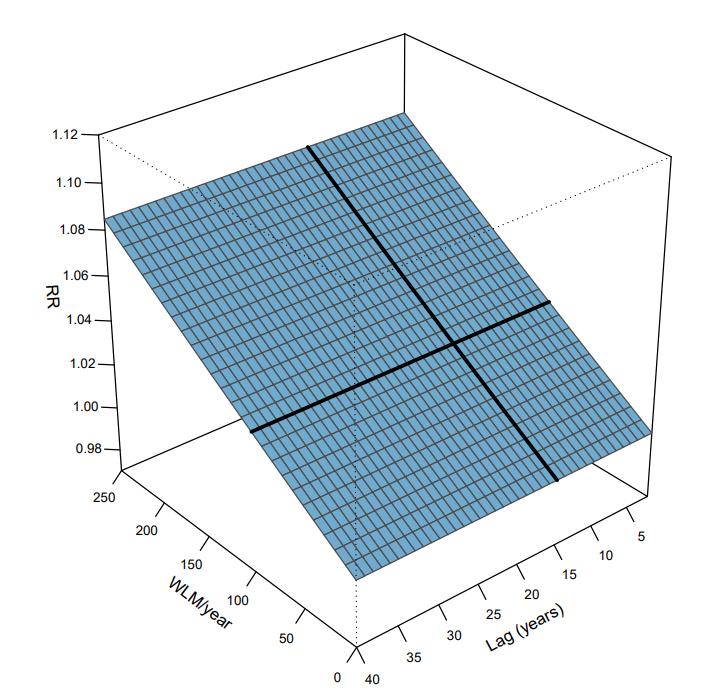{fig-align="center"}

## Spline-by-constant

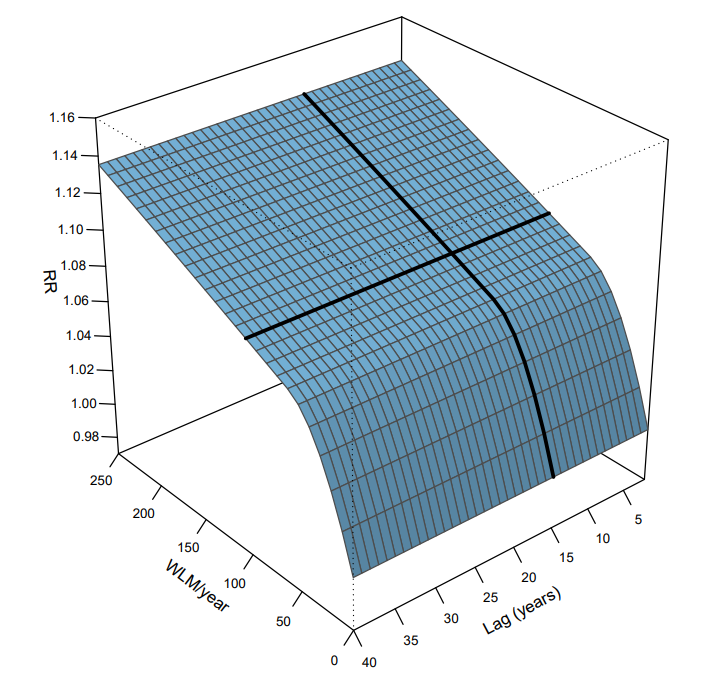{fig-align="center"}

## Step-by-step

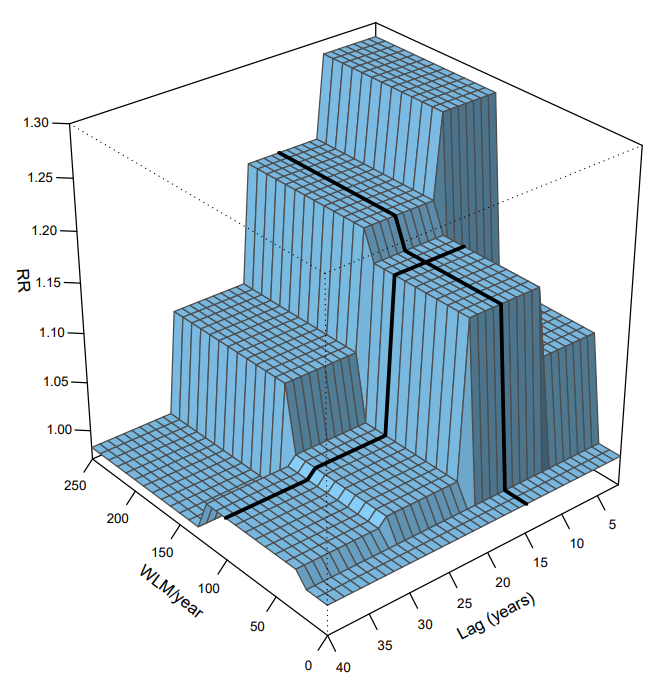{fig-align="center"}

## Spline-by-spline

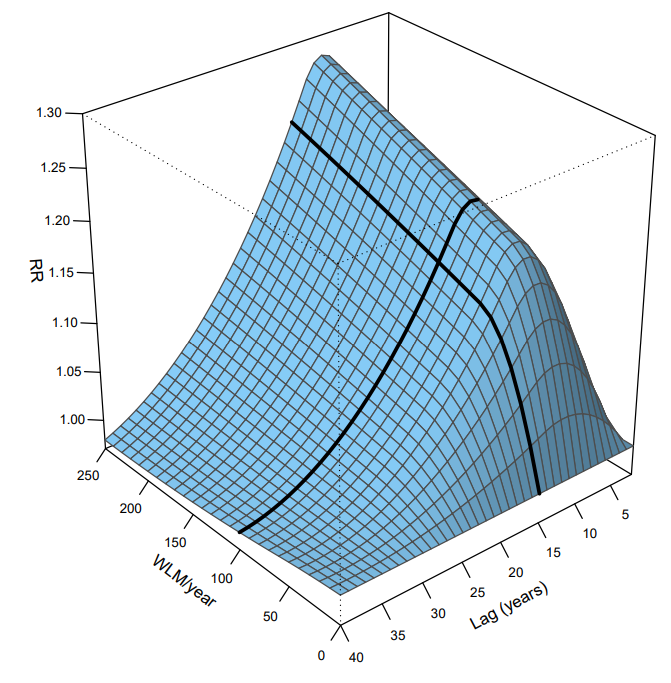{fig-align="center"}

## Example 3: Temperature in Chicago

```{r}
#| echo: true
#| eval: true
cb2.pm <- crossbasis(chicagoNMMAPS$pm10,
  lag = 1, argvar = list(fun = "lin"),
  arglag = list(fun = "strata")
)

varknots <- equalknots(chicagoNMMAPS$temp, fun = "bs", df = 5, degree = 2)
lagknots <- logknots(10, 3)
cb2.temp <- crossbasis(chicagoNMMAPS$temp, lag = 10, argvar = list(
  fun = "bs",
  knots = varknots
), arglag = list(knots = lagknots))


model_dlm2 <- mgcv::gam(death ~ cb2.pm + cb2.temp + s(time) + s(month) + dow,
  family = poisson(), chicagoNMMAPS
)

pred2.temp <- crosspred(cb2.temp, model_dlm2, cen = 21, by = 1)
```

## Example 3: Temperature in Chicago

```{r}
#| echo: true
#| eval: true
#| fig-align: "center"
#| fig-width: 5
plot(pred2.temp,
  xlab = "Temperature", zlab = "RR", theta = 200, phi = 40, lphi = 100,
  main = "3D graph of temperature effect"
)
```

::: {style="font-size: 70%;"}
## Example 3: Temperature in Chicago

```{r}
#| echo: true
#| eval: true
#| fig-align: "center"
library(plotly)
p <- plot_ly()
p <- add_surface(p, x = 0:10, y = -20:30, z = pred2.temp$matRRfit)

layout(p, scene = list(
  xaxis = list(title = "Lag"),
  yaxis = list(title = "Temperature", range = c(0, 30)),
  zaxis = list(title = "Relative risk")
))
```
:::

## Example 3: Temperature in Chicago

```{r}
#| echo: true
#| eval: true
#| fig-align: "center"
#| fig-width: 7
plot(pred2.temp, "contour",
  xlab = "Temperature", key.title = title("RR"),
  plot.title = title("Contour plot", xlab = "Temperature", ylab = "Lag")
)
```

## Example 3: Temperature in Chicago

```{r}
#| echo: true
#| eval: true
#| fig-align: "center"
plot(pred2.temp, "slices",
  var = 30, col = 1, ylim = c(0.95, 1.2), lwd = 1.5,
  main = "Lag-response curves for different temperatures, ref. 21C"
)
```

## Example 3: Temperature in Chicago

```{r}
#| echo: true
#| eval: true
#| fig-align: "center"
plot(pred2.temp, "slices",
  var = c(-20, 33), lag = c(0, 5), col = 4,
  ci.arg = list(density = 40, col = grey(0.7))
)
```

## Spatially varying coefficients

-   So far we assumed a single effect of an exposure across the study region.

-   However, different populations might experience different vulnerabilities to the effect of the exposure.

-   If these vulnerabilities have spatial structures, then the effect of the exposure will vary in space.

-   Spatial effect modification or spatial interaction

## Example 1: Heatwaves in Europe

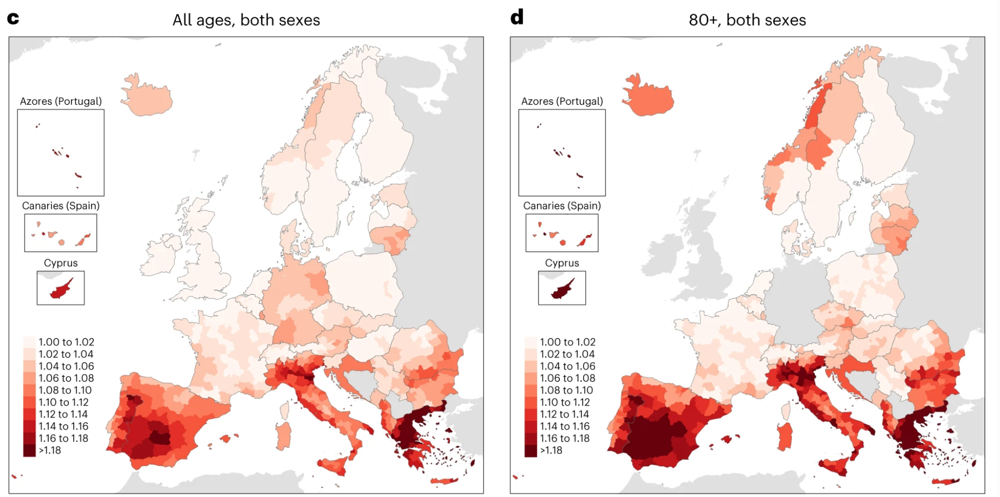{fig-align="center"}

## The model

We can write: $$
O_i \sim \text{Poisson}(\lambda_i E_i) \\
\log \lambda_i = \alpha + \color{red}{(\beta_1 + \delta_i)X_{1i}} + \beta_2 X_{2i} + \dots + \beta_k X_{ki} + \theta_i + \phi_i \\
\theta_i \sim \text{Normal}(0,\sigma_{\theta}^2)\\
\phi \sim \text{ICAR}(W, \sigma^2_{\phi}) \\
\color{red}{\delta \sim \text{ICAR}(W, \sigma^2_{\delta})}
$$ And a step further:

$$\delta_i = \gamma_0 + \sum \gamma_i Z_i + w_i$$

## Example 2: Temperature and COPD

::::: columns
::: {.column width="50%"}
-   3$^{\text{rd}}$ cause of death, 3.17 million deaths in 2015 globally,

-   In England, 115,000 emergency admissions and 24,000 deaths per year.

-   COPD exacerbations: Bacteria, viruses and air-pollution.

-   The role of temperature is unclear.
:::

::: {.column width="50%"}
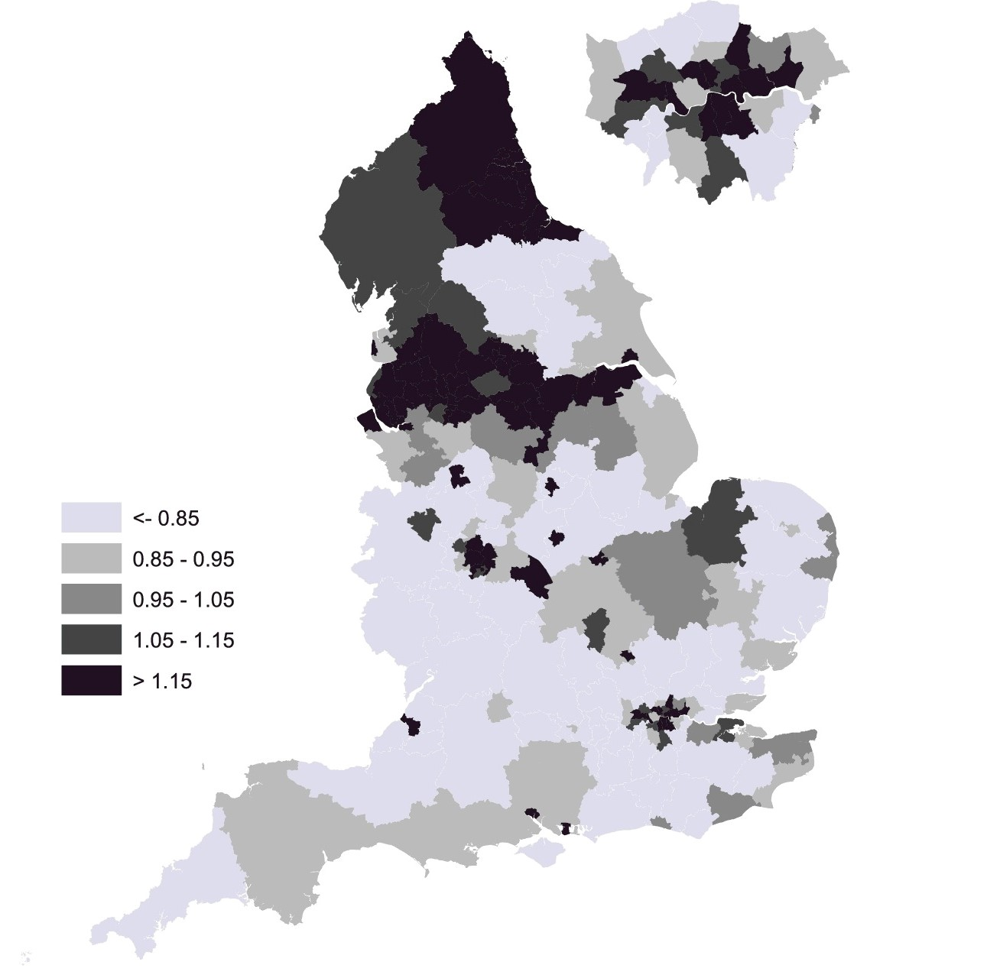{width="70%"}
:::
:::::

## Example 2: Temperature and COPD

::::: columns
::: {.column width="60%"}
-   Typically U-shaped relationship between temperature and health.

-   Individual effect modifiers: age, sex, chronic conditions

-   Temporal variation of the effect (adaptation)

-   Environmental effect modifiers: green space, urban heat island

-   Spatial vulnerabilities to heat exposure
:::

::: {.column width="40%"}

:::
:::::

## Example 2: Temperature and COPD

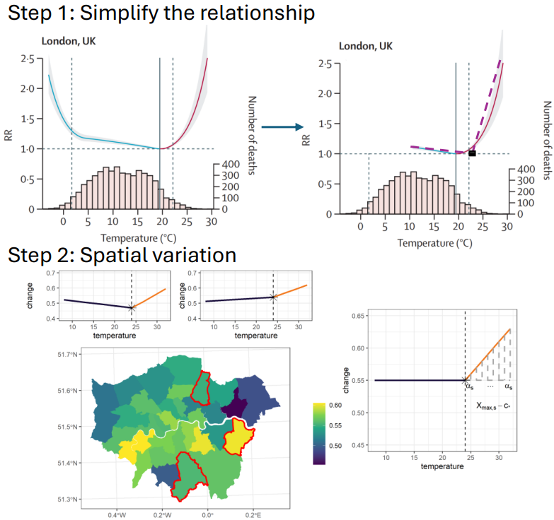{fig-align="center"}

## Example 2: Temperature and COPD

$$
Y{ijk} \sim \text{Poisson}(\mu_{ijk})\\
\log(\mu_{ijk}) = \alpha_1 I(X_{1i}<c)X_{1i} +\\ \qquad \qquad \qquad \qquad \alpha_{2s} I(X_{1i}\geq c)X_{1i} + \sum \beta_mZ_{mi} + u_j + w_k \\
\alpha_{2s} = \alpha_2 + \sum \gamma_l H_l + b_s
$$

-   Where should we put priors?

-   How should we select the priors?

## Example 2: Temperature and COPD

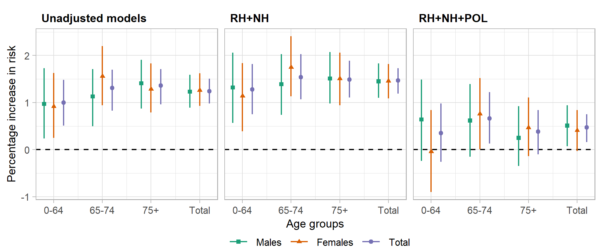

## Example 2: Temperature and COPD

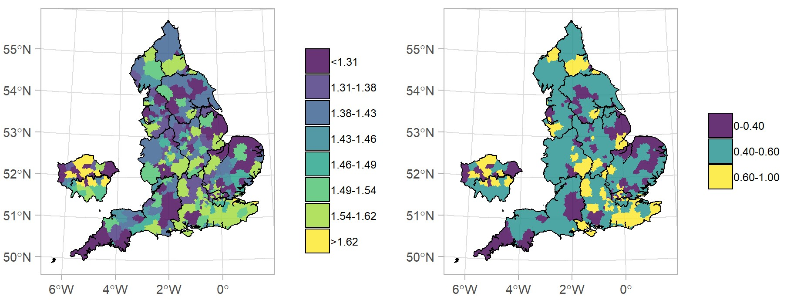

## Example 2: Temperature and COPD

::: {style="font-size: 70%;"}
| Effect modifier              | Percentage increase | Pr   |
|------------------------------|---------------------|------|
| Green space                  | -1.46 (-6.99, 4.39) | 0.30 |
| Average temperature          | -0.41 (-1.49, 0.71) | 0.22 |
| IMD Q1                       | 1                   | \-   |
| IMD Q2                       | 0.81 (-1.16, 3.08)  | 0.78 |
| IMD Q3                       | 1.57 (-0.76, 4.06)  | 0.91 |
| IMD Q4                       | 0.75 (-1.68, 3.36)  | 0.71 |
| IMD Q5                       | 1.62 (-1.31, 4.49)  | 0.85 |
| Predominantly Rural          | 1                   | \-   |
| Urban with significant rural | -0.79 (-3.10, 1.51) | 0.25 |
| Predominantly urban          | -1.57 (-4.16, 0.96) | 0.12 |
:::

## Example 2: Temperature and COPD

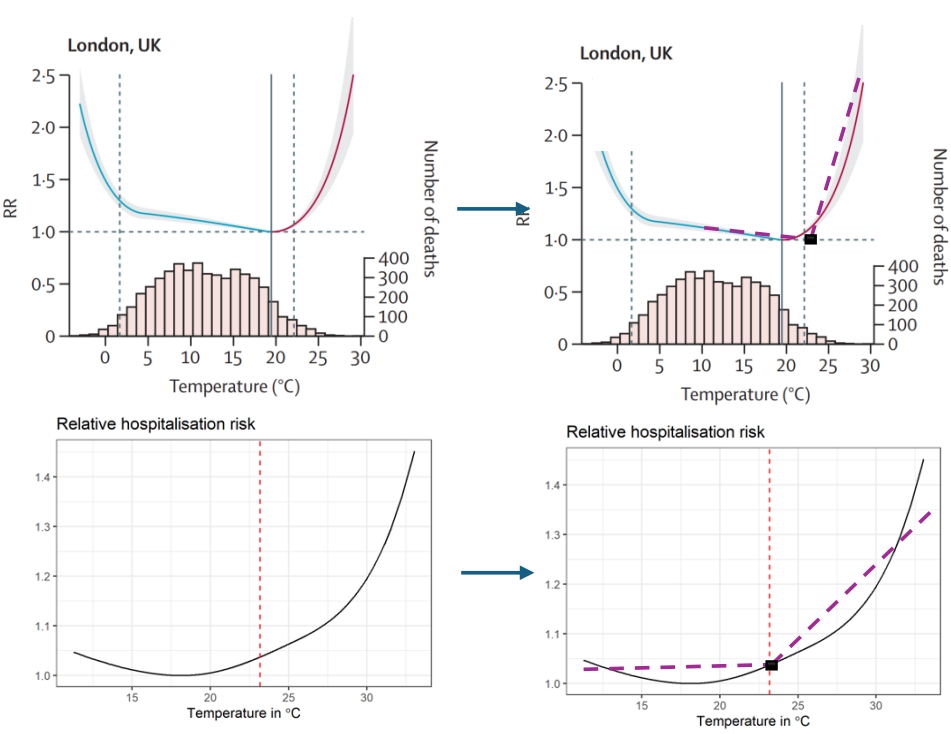{fig-align="center"}

## Modelling the Spatially Varying Non-Linear Effects of Heat Exposure

Main issues: a. data sparsity, b. spatial correlation

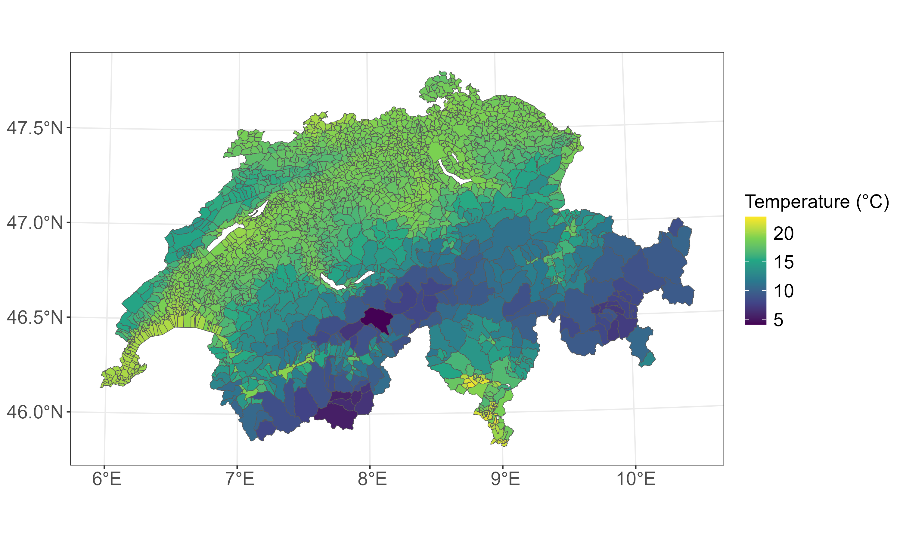{fig-align="center"}

## Beyond linear models: Case study

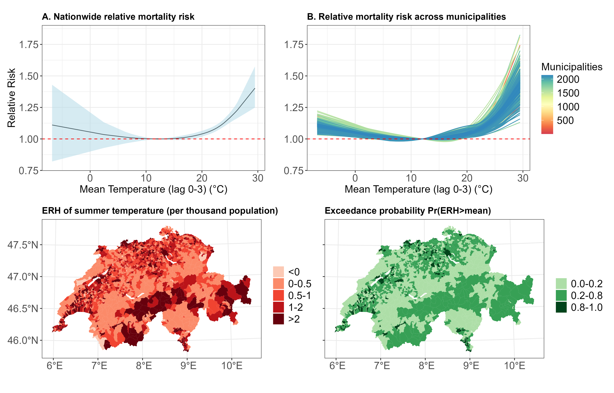{fig-align="center"}

## Beyond linear models: Effect modifiers

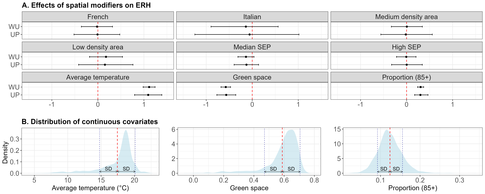{fig-align="center"}

## Summary

-   Introduction to distributed linear (and non-linear) lag models
-   Introduction to spatially varying coefficients
-   Spatial DLNMs
-   Examples using air-pollution, radon and temperature

::: {style="color: #58b364"}
Next : Coding some of these models in INLA.
:::
