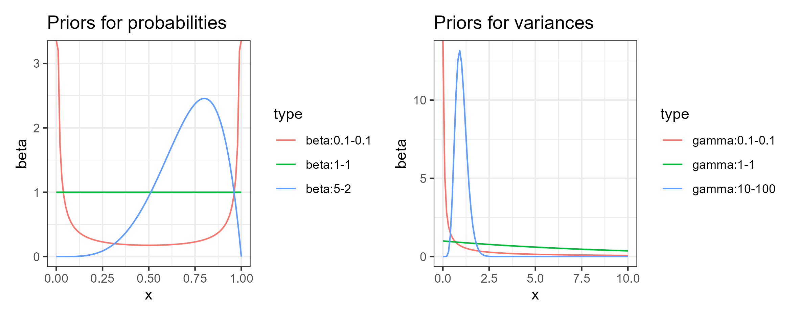

# Outline

-   Bayesian inference recap: What? Why? How?
-   What is a Bayesian workflow and why do we need it?
-   Principles of Bayesian workflow.
-   Modern Bayesian workflow.

# Bayesian inference

## Bayes formula:

$$p(\theta|y) = \frac{p(y | \theta) p(\theta)}{p(y)}$$ Can you recall what the components of the Bayes formula are?

{.r-stretch}

## Bayes formula:

$$p(\theta|y) = \frac{p(y | \theta) p(\theta)}{p(y)}$$ Can you recall what the components of the Bayes formula are?

{.r-stretch}

-   $p(\theta)$ is the *prior* distribution, i.e. what is known *a priori*.
-   $p(y|\theta)$ is the *likelihood*, i.e. probability of observing the data given parameters $\theta$.
-   $p(\theta|y)$ is the *posterior* distribution, i.e. the distribution of parameters of interest after data were observed.

## Bayes rule:

$$\underbrace{p(\theta|y)}_\text{posterior} \propto \underbrace{p(y | \theta)}_{\text{likelihood}}  \underbrace{p(\theta)}_{\text{prior}}$$

. . .

What can possibly go wrong?

. . .

A lot can go wrong!

## General principle of Bayesian inference:

-   Specify a complete Bayesian model:
    -   Specify likelihood.
    -   Specify priors for all parameters. (saying "I don't know" is also a prior)

## General principle of Bayesian inference:

-   Example:
    -   Consider **data** $y = \{ y_1, ..., y_n\}$
    -   Specify an **observation model**, e.g. $$p(y|\theta) = \prod_i N(y_i | \theta, \sigma^2)$$ <!-- - here $\theta$ is a parameter which we want to infer-->
    -   complete the model with a prior distribution, e.g. $$p(\theta)=N(0,1)$$

## General principle of Bayesian inference:

-   Specify a complete Bayesian model.
-   Sample the posterior distribution of the parameter $\theta$.

. . .

Sometimes posterior is available in a closed form.

. . .

-   Examples of *conjugate* models include the normal-normal, Gamma-Poisson Beta-binomial.

## Probabilistic programming languages

Probabilistic programming languages (PPLs) from a user's perspective:

-   PPLs are designed to let the user **focus on modelling** while inference happens automatically.
-   Users need to specify:
    -   Prior.
    -   Likelihood.
-   Inference is performed via powerful algorithms such as, Markov Chain Monte Carlo (**MCMC**).
-   Availability of **diagnostic tools**.

## Remark on inference methods

-   Alongside "exact"methods such as MCMC, there also exists approximate methods, such as Variation Inference (VI) and integrated nested Laplace approximation.
-   The approximate methods are less flexible and there is no guaranteed *convergence*.
-   We are opting to use MCMC whenever possible since it has theoretical guarantees (conditional on time the chain will *converge*).

# Principles of Bayesian workflow

## Workflows as a 'good practice'

Workflows exist in a variety of disciplines. For example, in machine learning, workflow standards are being formalised under the name of MLOps:

<center>

{width="50%"}

## Box's loop

In the 1960's, the statistician Box formulated the notion of a loop to understand the nature of the scientific method. This loop is called Box's loop by Blei et. al. (2014):

<center>

{width="60%"}

## Modern Bayesian workflow

A systematic review of the steps within the modern Bayesian workflow, described in Gelman et al. (2020):

<center>

{width="40%"}

## Iterative model building

-   Understand the **domain** and problem.
-   Formulate the model **mathematically**.
-   Implement model, test, **debug**.
-   Perform **prior predictive** check.
-   Fit the model.
-   Assess **convergence diagnostics**.
-   Perform **posterior predictive** check.
-   Improve the model **iteratively**: from baseline to complex and computationally efficient models.

## Some generic checks

-   Priors:

    -   How to select a prior? (partly philosophical)

    -   Is our prior compatible with the data? (prior predictive checks)

-   Posterior (or MCMC output):

    -   Convergence diagnostics (traceplots, autocorrelation plots, etc.)

    -   Model fit (posterior predictive checks)

    -   Others: Model predictive ability (cross-validation), model selection (information criteria)

## How to select a prior?

-   The prior should allow adequate exploration of the parameter space of the random variable.

-   The prior should be compatible with the nature of the random variable.

-   The priors should reflect our prior knowledge.

## Example 1: The prior is too strict

```{r}
#| echo: false
#| eval: true
#| fig-align: "center"
#| fig-width: 10

library(ggplot2); library(dplyr); library(patchwork)

set.seed(11)
x <- seq(from = -1, 
         to = 2, 
         length.out = 500)


data.frame(x=x, 
           y=dunif(x=x, min = -1, max = 1), 
           z=dnorm(x=x, mean = 1, sd = 0.2)) -> df
df %>% 
  ggplot() + 
  geom_ribbon(aes(x=x, ymin = 0, ymax = y), 
              fill = "red", alpha = 0.5) + 
  geom_ribbon(aes(x=x, ymin = 0, ymax = z), 
              fill = "blue", alpha = 0.5) + 
  theme_bw() + 
  ggtitle("Prior-posterior plot") -> p1

df2 = 
  data.frame(
    x = 1:500,
    y = rnorm(n = 500, mean = 1, sd = 0.2)
  ) %>% 
  mutate(y = ifelse(y>1, 1, y)) 

df2 %>% 
  ggplot() + 
  geom_line(aes(x=x, y=y)) + theme_bw() + 
  ggtitle("Traceplot of the posterior")-> p2

p1|p2

```

## Example 2: Respect the nature of the random variable

How should we model probabilities and variances?

```{r}
#| echo: false
#| eval: false
#| fig-align: "center"
#| fig-width: 15

beta.plots <-
  data.frame(
    x = rep(seq(from = 0, to = 1, length.out = 100), times = 3), 
    beta = c(
      dbeta(x = x, shape1 = 0.1, shape2 = 0.1), 
      dbeta(x = x, shape1 = 1, shape2 = 1), 
      dbeta(x = x, shape1 = 5, shape2 = 2)
    ), 
    type = rep(c("beta:0.1-0.1", "beta:1-1", "beta:5-2"), 
               each = 100)
  )

beta.plots$type <- as.factor(beta.plots$type)

ggplot() + 
  geom_line(data = beta.plots, 
            aes(x=x, y=beta, group = type, col = type)) + 
  ggtitle("Priors for probabilities") + theme_bw() -> p3

variance.plots <-
  data.frame(
    x = rep(seq(from = 0.001, to = 10, 
                length.out = 100), times = 3), 
    beta = c(
      dgamma(x = x, shape = 0.1, rate = 0.1), 
      dgamma(x = x, shape = 1, rate = 1), 
      dgamma(x = x, shape = 10, rate = 100)
    ), 
    type = rep(c("gamma:0.1-0.1", "gamma:1-1", "gamma:10-100"), 
               each = 100)
  )

variance.plots$type <- as.factor(variance.plots$type)
ggplot() + 
  geom_line(data = variance.plots, 
            aes(x=x, y=beta, group = type, col = type)) + 
  ggtitle("Priors for variances") + theme_bw() -> p4

p3|p4

ggsave("variance.png", width = 20, height = 8, units = "cm", dpi = 300)
```

{width="80%"}

## Priors should reflect our prior knowledge

*I know that I know nothing*. Socrates

-   If you do know, then priors should reflect your knowledge.

    -   Treatment effects for numerous previous studies or meta-analysis.

    -   How smooth an effect can be. (we will discuss later)

-   If you do not know, then the priors should reflect your lack of knowledge.

    -   Vague priors, non-informative priors.

## Prior predictive checks

**Prior predictive checking** consists in simulating data from the priors:

-   Visualize priors. (especially after transformation)
-   This shows the range of data compatible with the model.
-   It helps understand the adequacy of the chosen priors, as it is often easier to elicit expert knowledge on measureable quantities of interest rather than abstract parameter values.

# Examples

## Data

Assume that the true data comes from the model $$y_i = a + b x_i + \epsilon_i, \quad \epsilon_i \sim N(0, \sigma^2).$$

<center>

{width="45%"}

## Model

We implemented the model in our favourite PPL:

``` r
code <- nimbleCode({
  for (i in 1:n) {
    y[i] ~ dnorm(a, sd = sigma)
  }
})
```

## Prior predictive check

Let us draw samples **from the priors**, i.e. we are **not using any data at this stage yet**, only trying to see what kind of data ($y$) this model is able to generate.

. . .

<center>

{width="45%"}

## Prior predictive check

Something doesn't look right...

. . .

<center>

{width="45%"}

## Debug

There was a bug in the model. Let's correct it:

``` r
code <- nimbleCode({
  a ~ dnorm(0, sd = 100)
  b ~ dnorm(0, sd = 100)
  sigma ~ T(dnorm(0, sd = 10))

  for (i in 1:n) {
    y[i] ~ dnorm(a + b * x, sd = sigma)
  }
})
```

## Prior predictive check again

<center>

{width="45%"}

Better: now the range of prior predictive draws is covering the data. 

## Posterior checks (MCMC output)

We use multiple chains of MCMC to estimate the posterior:

. . .

<center>

{width="50%"}

## Diagnosing MCMC outputs

-   Convergence diagnostics
    -   $\hat{R}$ statistic,
    -   traceplots.
-   Effective sample size (ESS):
    -   Samples will be typically autocorrelated within a chain, which increases the uncertainty of the estimation of posterior quantities.
    -   ESS -- number of *independent* samples required to obtain the same level of uncertainty as from the available dependent samples.

## Diagnosing MCMC outputs

We use multiple chains of MCMC to inspect convergence after warm-up:

. . .

<center>

{width="50%"}

## Diagnosing MCMC outputs

We use multiple chains of MCMC to inspect convergence after warm-up:

. . .

<center>

{width="50%"}

...

## Diagnosing MCMC outputs

The post-warm-up samples of $\theta$ approximate its **posterior** distribution:

. . .

<center>

{width="50%"}

## Posterior predictive checks

This examines how well your model fits the data.

-   The idea is to compare the posterior of the fitted values with the observed values of your data.

-   You can try different things: correlation, mean squared error, bias, coverage probability.

{fig-align="center"}

## Other

-   Cross validation -- The idea is to act like some of your data is missing, use your model to predict it, and then compare what the model predicts *well* with the truth.

    -   How do you select the *missing* data and what does *well* mean?

-   Information criteria -- Penalise complexity over the fit. The smaller the better. 
    -  Examples: DIC, WAIC, AIC, BIC, etc.

-   Deviance + p

# Questions?
