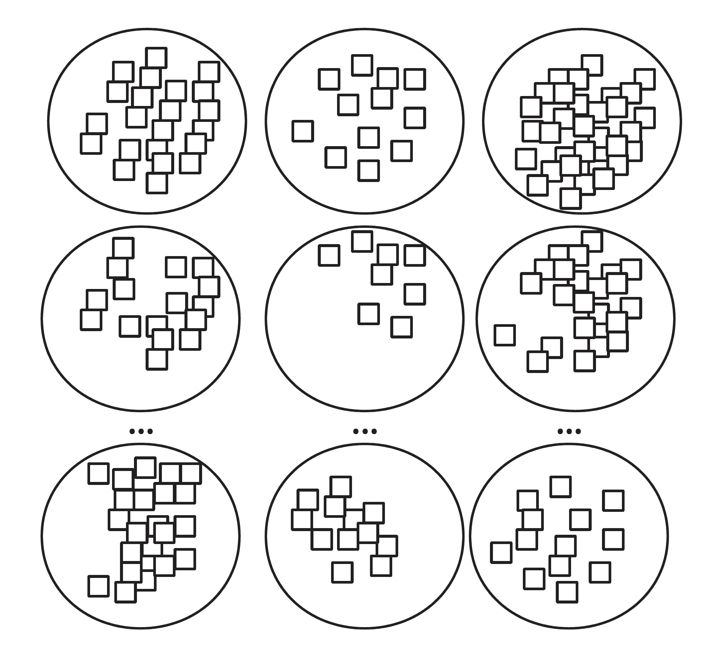
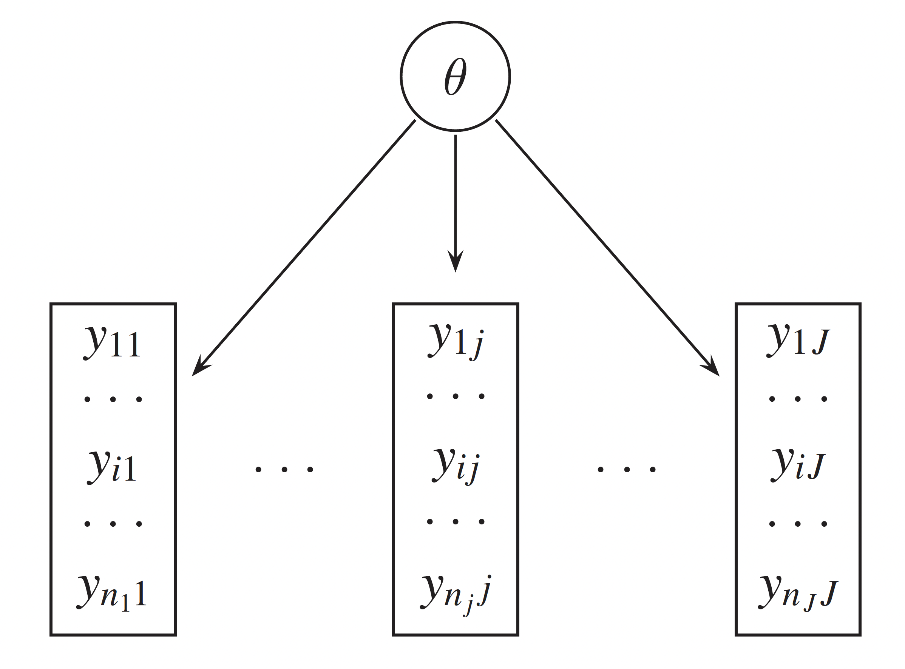
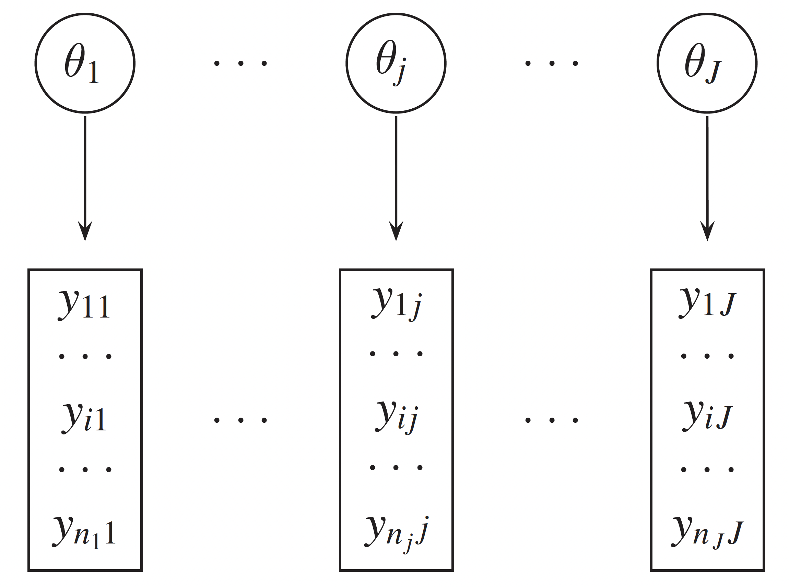
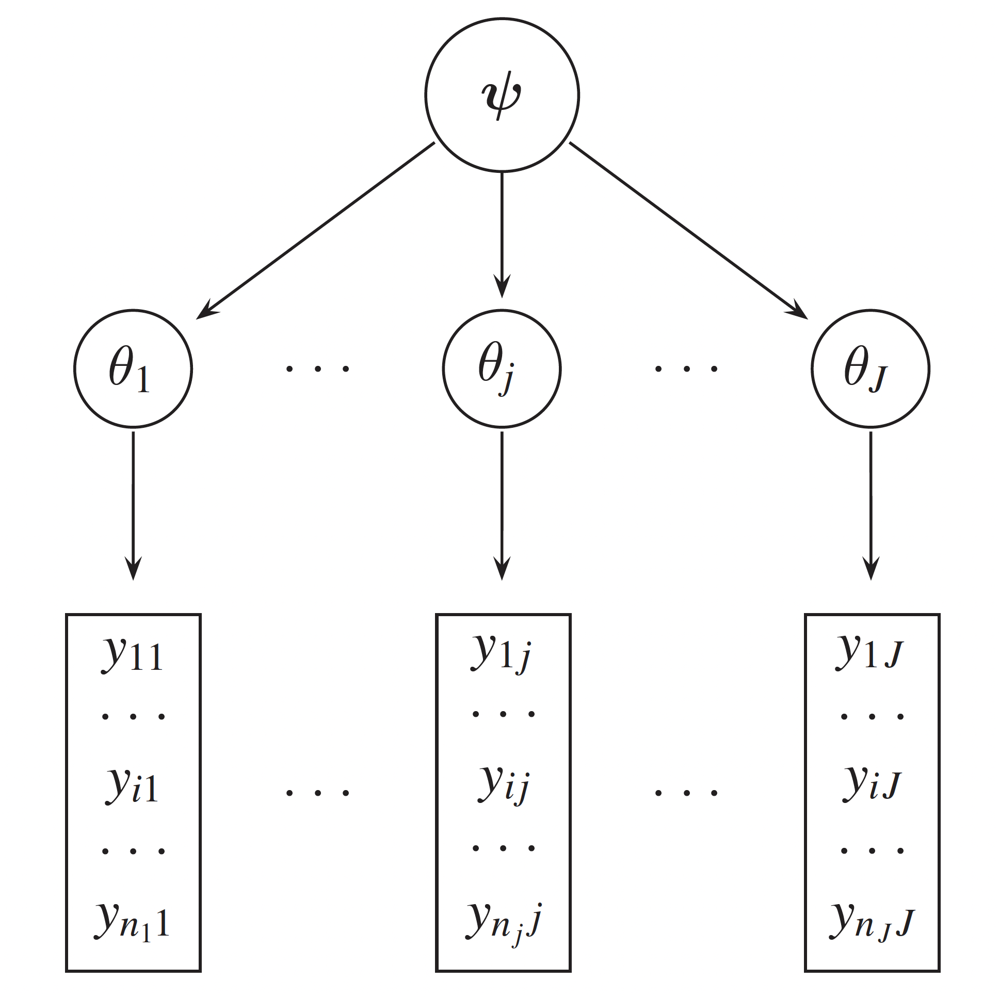

```{r, echo=FALSE, warning=FALSE, message=FALSE}
library(here)
library(tidyverse)
library(nimble)
library(bayesplot)
library(posterior)
library(hrbrthemes)
library(sf)
library(colorspace)

extrafont::loadfonts()
theme_set(theme_ipsum())

color_scheme_set(scheme = "viridis")

set.seed(2)
```

## Outline

-   Models characterized by several parameters
-   Assumptions of linear models
-   What we want beyond linear model
-   Hierarchical models
-   Levels of hierarchy
-   Comparing to frequenist random effects
-   Bayesian advantages
-   Model selection
-   Information criteria

## Models characterized by several parameters

-   In many statistical applications, the model is characterized by
    several parameters.
-   Many real-world problems involve data grouped by source, area, time,
    etc.
-   Non-hierarchical models assume independence between units - often
    inappropriate.

## Models characterized by several parameters

::: nonincremental
-   Sample `R` code:
:::

``` r
data <- read_rds(here("data", "italy", "italy_mortality.rds"))
glimpse(data)
summary(data)
```

## Models characterized by several parameters

```{r}
data <- read_rds(here("data", "italy", "italy_mortality.rds"))
glimpse(data)
```

## Models characterized by several parameters

```{r}
summary(data)
```

## Models characterized by several parameters

{fig-align="center"}

## Models characterized by several parameters

<center>

{width="40%"}

{width="40%"}

## Assumptions of linear models

-   Independence of observations.
-   Constant error variance (homoskedasticity).
-   Single set of parameters apply to all observations.
-   No measurement error in predictors.
-   Complete data.

## Assumptions of linear models

-   Independence of observations. [Data often
    clustered.]{style="color:red"}
-   Constant error variance (homoskedasticity). [Variability often
    differs across groups.]{style="color:red"}
-   Single set of parameters apply to all observations. [Subgroups may
    have different parameters.]{style="color:red"}
-   No measurement error in predictors. [Predictors are often
    noisy.]{style="color:red"}
-   Complete data. Missingness is common. [Missingness is
    common]{style="color:red"}.

## What we want beyond linear model

-   To appropriately model grouped or nested data (e.g., individuals
    within regions, time within subjects).
-   To allow for group-specific effects (e.g., varying intercepts or
    slopes across groups).
-   To borrow strength across groups, improving estimates for small or
    noisy groups.
-   To relax the assumption of independence by accounting for
    intra-group correlation.
-   To model heterogeneity in variances across groups or levels.
-   To introduce structure in parameters, linking them through shared
    hyperparameters.

## What we want beyond linear model

-   To propagate uncertainty across levels of the model (data,
    parameters, hyperparameters).
-   To handle missing data naturally through the model hierarchy.
-   To incorporate prior knowledge at multiple levels of the model.
-   To support flexible generalizations (e.g., nonlinear relationships,
    spatiotemporal structure, GLMs).
-   To incorporate prior information and quantify uncertainty at
    multiple levels.
-   To represent spatial, temporal, or hierarchical dependence in data.

## Complete pooling {.smaller}

<center>

{width="40%"}

-   A *pooled* model implies that the data are sampled from the same
    model.
-   This ignores all variation among the units being sampled.
-   All observations share common parameter $\theta.$
-   It ignores any differences between measurement blocks and does not
    acknowledge variability block to block (second level units).
-   However, observations within each unit are more likely to be like
    each other.

## Complete pooling (from lab)

Priors $$
\alpha \sim N(0, 5)
$$

Likelihood $$
\begin{split}
y_i &\sim \text{Pois}(\mu_i) \quad i = 1,..., N \\
\log(\mu_i) &= \log(E_i) + \alpha
\end{split}
$$

## Complete pooling (from lab)

{fig-align="center"}

## No pooling {.smaller}

<center>

{width="40%"}

-   An *unpooled* model implies that the data are sampled from
    independent parameters.
-   ($\theta_1$,$\theta_2$ etc.) drawn independently from e.g.,
    $\theta_j \sim N(0, 1000)$.
-   Parameter $\theta_j$ is different for each set of observations.
-   No exchange of information between $\theta_j$'s.

## No pooling (from lab)

Priors $$
\alpha_j \sim N(0, 1) \quad j = 1,..., N_p
$$

Likelihood $$
\begin{split}
y_i &\sim \text{Pois}(\mu_i) \quad i = 1,..., N \\
\log(\mu_i) &= \log(E_i) + \alpha_{j[i]}
\end{split}
$$

## No pooling (from lab)

{fig-align="center"}

## Hierarchical models

-   Many real-world problems involve data grouped by source, geography,
    time, etc.
-   Non-hierarchical models assume independence—often inappropriate.
-   Hierarchical models:
    -   Allow varying group-specific effects.
    -   Improve estimates through sharing information (shrinkage).

## Hierarchical models

Exist on the continuum between two extreme cases:

-   Complete pooling (one common parameter).
-   [Partial pooling!]{style="color:red"}
-   No pooling (independent parameters).

## Partial pooling {.smaller}

<center>

{width="40%"}

-   In a *partially pooled* or *multilevel* or *hierarchical* model,
    parameters are viewed as a sample from a distribution of parameters.

## Partial pooling (from lab)

Priors $$
\begin{split}
\alpha &\sim N(0,5), \\
\sigma_p &\sim N^+(1) \\
\theta_j &\sim N(0, \sigma^2_p) \quad j = 1,..., N_p
\end{split}
$$

Likelihood $$
\begin{split}
y_i &\sim \text{Pois}(\mu_i) \quad i = 1,..., N \\
\log(\mu_i) &= \log(E_i) + \alpha + \theta_{j[i]}
\end{split}
$$

## Partial pooling (from lab)

{fig-align="center"}

## Hierarchical (partial pooling) models

-   Hierarchical models (partial pooling) fill in the continuum between
    the two extremes.
-   They allow us to estimate models for each measurement block where
    each dataset is being fit to its own model.
-   There is a higher level model, a *hierarchical model*, describing
    variability in parameters of those sub-models.

## Comparison of pooling strategies

| Pooling Type       | Group estimates independent? | Shrinkage  | Frequentist equivalent | Bayesian benefit                 |
|--------------------|------------------------------|------------|-------------------------|----------------------------------|
| No Pooling         | Yes                          | None       | Fixed effects           | None                             |
| Full Pooling       | No (same for all)            | Complete   | No group effects        | Simple prior                     |
| Partial Pooling    | No (partially informed)      | Adaptive   | Random effects          | Full posterior with hierarchy    |

## Levels of hierarchy

-   Data
-   Process model (likelihood)
-   Parameter model (priors)
-   Hyperparameters (hyperpriors)

## Partial pooling again

Priors $$
\begin{split}
\alpha &\sim N(0,5), \\
\sigma_p &\sim N^+(1) \\
\theta_j &\sim N(0, \sigma^2_p) \quad j = 1,..., N_p
\end{split}
$$

Likelihood $$
\begin{split}
y_i &\sim \text{Pois}(\mu_i) \quad i = 1,..., N \\
\log(\mu_i) &= \log(E_i) + \alpha + \theta_{j[i]}
\end{split}
$$


## Comparing to frequenist random effects

-   Frequentist random effects models are similar in some ways to
    Bayesian hierarchical models.
-   They allow for group-specific effects and account for intra-group
    correlation.
-   However, they do not:
    -   Provide a full probabilistic framework.
    -   Incorporate prior information.

## Comparing to frequentist random effects

-   Bayesian hierarchical models:
    -   Allow for uncertainty quantification at multiple levels.
    -   Provide a coherent framework for model comparison and selection.
    -   Enable the incorporation of prior knowledge and beliefs.

## Bayesian advantages

- Handles complex multilevel and spatial hierarchies.
- Uses structured priors (CAR, GMRF) for spatial dependence.
- Supports flexible, non-Gaussian priors.
- Provides full uncertainty via posterior distributions.
- Easily incorporates expert knowledge through priors.
- Enables spatiotemporal and nonstationary extensions.
- Frequentist methods often limited or approximate.

## Model selection

-   Model selection is the process of choosing between different models
    based on their performance on a given dataset.
-   Frequentist:
    -   optimise different models on the **training set**,
    -   and compare them on the **test set**.
-   Bayesian:
    -   use **model evidence** $p(Data | Model_i)$
    -   It tends to choose models which are just complex enough to model
        the data, but not overly complex (by which it avoids
        **overfitting**).

## Information criteria

*Information criteria* are popular tools for model selection that
provide a quantitative measure of the trade-off between model fit and
complexity. The *lower* the value of IC, the better.

## Common information criteria {.smaller}

-   AIC (Akaike Information Criterion):
    $$\text{AIC} = -2* \ln(L) + 2k,\\
    L - \text{maximum value of likelihood},\\
    k - \text{number of parameters}$$
-   BIC (Bayesian Information Criterion):
    $$\text{BIC} = -2 \ln(L) + k \ln(n)$$
-   Widely Applicable Information Criterion (WAIC)
    $$\text{WAIC} = -2 \sum_{i=1}^{n} \left( \ln(\hat{p}(y_i)) - \text{Var}(\ln(p(y_i))) \right)$$

# Getting ready for the lab

## The lab for this session {.smaller}

-   This lab will involve introducing hierarchical modelling using the
    `NIMBLE` modelling framework.

-   During this lab session, we will:

1.  Write a hierarchical model in `NIMBLE`;
2.  Compare the model to more basic non-hierarchical models; and
3.  Discuss the advantages of hierarchical models.

# Questions?
