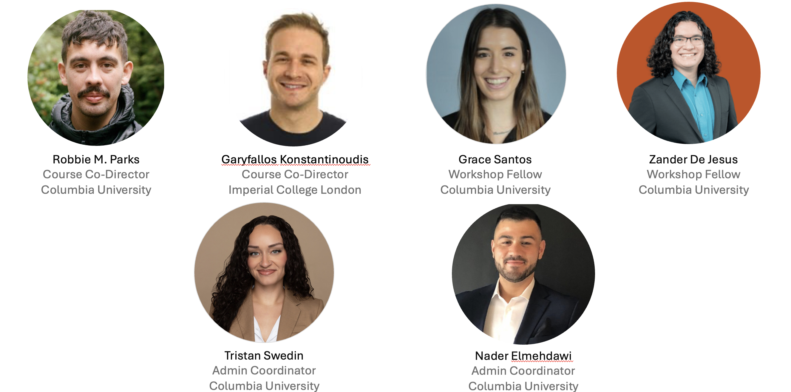
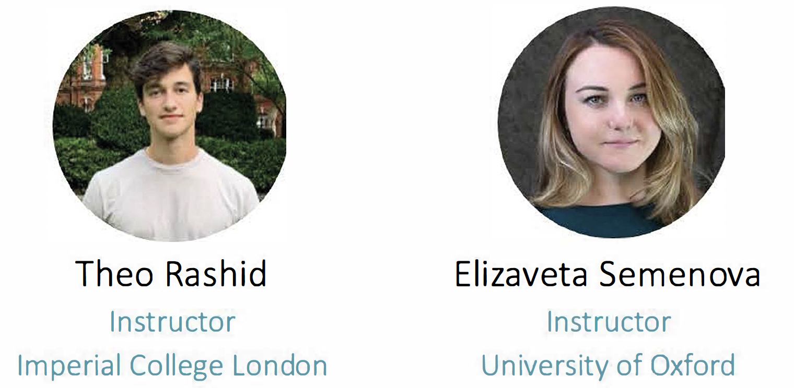
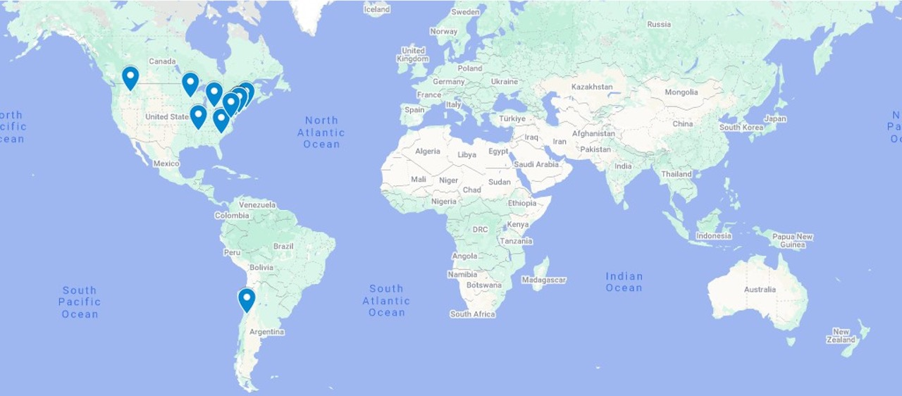

# Welcome!

## Logistics {.smaller}

-   **Wi-Fi** Network: guest-net (no password). Open any webpage on your browser, a pop-up will appear to connect to guest Wi-Fi. Accept terms to gain access.
-   **Restrooms**. Directly outside the classroom to the right.
-   **Course materials**. All material (lectures/labs) is located on Posit Cloud. You were invited to the ‘sharp_bayesian_environmental_health_2025’ workspace via email a few days ago.
-   **Name tags**. Please wear during workshop to make connecting with others easier! Please return them after the Workshop to help us be greener.
-   Contact Admin Coordinator Tristan Swedin **ts3716@cumc.columbia.edu** for any assistance.

## Overview of workshop

The **Bayesian Modeling for Environmental Health Workshop** is a two-day intensive course of seminars and hands-on sessions to provide an *approachable* and *practical* overview of **concepts**, **techniques**, and **data analysis methods** used in Bayesian modeling with applications in Environmental Health.

## Overview of workshop

::: incremental
-   By the end of the workshop, participants should be familiar with the following topics:

    -   Principles of Bayesian statistics
    -   Bayesian workflow
    -   Hierarchical modeling
    -   Non-linear regression
    -   Spatial and spatio-temporal modeling
    -   Software options
    -   Advanced models
:::

## Bayesian Modelling Workshop Team




## Special thank you



## 13 US States + 1 country



## Day 1 (August 14th 2025)

::: {style="font-size: 50%;"}
| Time | Activity |
|--------------------------|----------------------------------------------|
| 8:30 - 9:00 | Check in and breakfast |
| 9:00 - 9:15 | Welcome and introduction|
| 9:15 - 10:00 | Principles of Bayesian statistics (Lecture) |
| 10:00 - 10:15 | Break |
| 10:15 - 11:00 | Principles of Bayesian statistics (Hands-on Lab) |
| 11:00 - 11:15 | Break |
| 11:15 - 12:00 | Bayesian workflow (Lecture) |
| 12:00 - 1:00 | Lunch |
| 1:00 - 1:45 | Hierarchical modeling (Lecture) |
| 1:45 - 2:00 | Break |
| 2:00 - 2:45 | Hierarchical modelling (Hands-on Lab) |
| 2:45 - 3:00 | Questions and wrap-up |
| 3:00 - 3:45 | Non-linear regression (Lecture) |
| 3:45 - 4:00 | Break |
| 4:00 - 4:45 | Non-linear regression (Hands-on Lab) |
| 4:45 - 5:00 | Questions and wrap-up |
:::

## Day 2 (August 15th 2025)

::: {style="font-size: 50%;"}
| Time | Activity |
|--------------------------|----------------------------------------------|
| 8:30 - 9:00 | Check in and breakfast |
| 9:00 - 10:00 | Spatial and spatio-temporal modeling (Lecture) |
| 10:00 - 10:15 | Break |
| 10:15 - 11:00 | Spatial and spatio-temporal modelling (Hands-on Lab) |
| 11:00 - 11:15 | Break |
| 11:15 - 12:00 | Software options (Lecture) |
| 12:00 - 1:00 | Lunch |
| 1:00 - 1:45 | Software options (Hands-on Lab) |
| 1:45 - 2:00 | Break |
| 2:00 - 2:45 | Advanced models (Lecture) |
| 2:45 - 3:00 | Break |
| 3:00 - 3:45 | Advanced models (Hands-on Lab) |
| 3:45 - 4:30 | Interactive panel discussion & course wrap-up |
| 4:30 - 5:00 | Final farewell |
:::

## What is your experience level with R? {.smaller}

```{r}
# Load packages
library(tidyverse)
library(hrbrthemes)

# Load dataset
df <- read_csv("assets/experience_level_r.csv") |>
  mutate(experience_level = as.factor(experience_level)) |>
  mutate(experience_level = fct_relevel(experience_level, c("Beginner/little experience", "Some limited experience", "Extensive experience")))

# Plot
p <- ggplot(df, aes(x = experience_level)) +
  geom_bar() +
  xlab("Experience level with R") +
  scale_y_continuous(breaks = function(x) unique(floor(pretty(x)))) +
  theme_ipsum()

plot(p)
```

## Logistics {.smaller}

-   **Wi-Fi** Network: guest-net (no password). Open any webpage on your browser, a pop-up will appear to connect to guest Wi-Fi. Accept terms to gain access.
-   **Restrooms**. Directly outside the classroom to the right.
-   **Course materials**. All material (lectures/labs) is located on Posit Cloud. You were invited to the ‘sharp_bayesian_environmental_health_2025’ workspace via email earlier this week.
-   **Name tags**. Please wear during workshop to make connecting with others easier! Please return them after the Workshop to help us be greener.
-   Contact Admin Coordinator Tristan Swedin **ts3716@cumc.columbia.edu** for any assistance.

# Questions?
